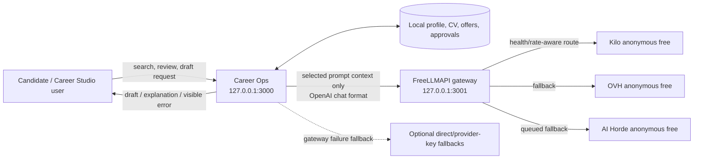

# System context — Career Ops with FreeLLMAPI

Trust boundary: profile, tracker, drafts, secrets, and process records are local files. Only the selected prompt context leaves the machine. Anonymous provider privacy and retention policies apply to that content.
