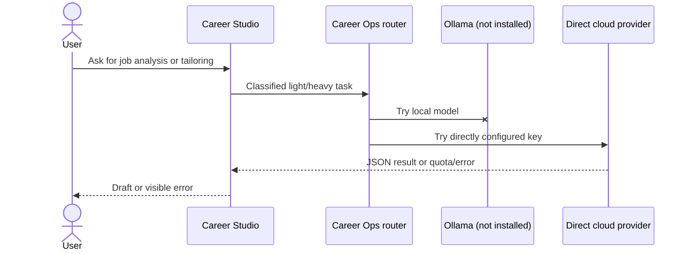

# Data flow — before and after

## Before



## After

```mermaid
sequenceDiagram
    actor User
    participant Studio as Career Studio
    participant Router as Career Ops router
    participant Gateway as FreeLLMAPI localhost:3001
    participant Free as Free upstream pool
    participant Direct as Direct fallback
    User->>Studio: Ask for job analysis or tailoring
    Studio->>Router: Classified light/heavy task
    Router->>Gateway: POST /v1/chat/completions, model=auto
    loop Healthy candidates
        Gateway->>Free: Route request
        alt success
            Free-->>Gateway: Completion
            Gateway-->>Router: OpenAI-shaped JSON
        else 429 / 5xx / timeout
            Free-->>Gateway: Failure
            Gateway->>Free: Next eligible route
        end
    end
    opt Gateway exhausted or offline
        Router->>Direct: Next configured Career Ops provider
    end
    Router-->>Studio: Parsed JSON or explicit exhausted-chain error
    Studio-->>User: Reviewable output; no automatic application
```

The outer Career Ops router and the inner FreeLLMAPI router are intentionally separate. FreeLLMAPI manages upstream health and rate-aware selection. Career Ops retains a gateway-level fallback and its review/approval boundaries.
